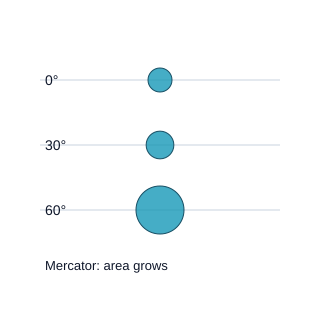
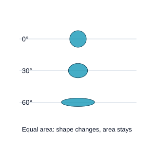

# មេរៀនទី៣៖ ចំណោលផែនទី និងការខូចទ្រង់ទ្រាយ

!!! note "អំពីលេខក្នុងឧទាហរណ៍ដើម"
    តួលេខផ្ទៃជាក់លាក់ខាងក្រោមត្រូវបានរក្សាពីគម្រោងដើម។ ឯកសារព្រំដែនពេញលេញមិនមានក្នុង ZIP ដើម ដូច្នេះប្រើជាឧទាហរណ៍សិក្សា មិនមែនជាលទ្ធផលវាស់ដែលបានផ្ទៀងផ្ទាត់ក្នុងកំណែនេះ។ ពេលធ្វើឡើងវិញ ត្រូវកត់ប្រភពព្រំដែន CRS និងវិធីវាស់។

!!! info "ព័ត៌មានមេរៀន"
    **រយៈពេលបង្រៀនដែលស្នើ៖ ៣ ម៉ោង** · មេរៀនទី ៣ ក្នុងចំណោម ១៥

មិនអាចពន្លាសំបកក្រូចឲ្យសំប៉ែតដោយមិនហែក ឬលាតបានទេ។ ផែនដីក៏ដូច្នោះដែរ។ **ចំណោលផែនទី (Map projection)** គឺជាវិធីបម្លែងកូអរដោនេពីផ្ទៃកោងនៃអេលីបសូអ៊ីត ទៅប្លង់សំប៉ែត ហើយគ្រប់ចំណោលទាំងអស់ធ្វើឲ្យអ្វីមួយខូច៖ ផ្ទៃ រាង ចម្ងាយ ឬទិស។

មេរៀននេះពន្យល់ប្រភេទចំណោល ការខូចទ្រង់ទ្រាយ ប្រព័ន្ធ UTM ដែលកម្ពុជាប្រើ និងរបៀបជ្រើសចំណោលសមស្របសម្រាប់ផែនទីនីមួយៗ។

---

## ៣.១. គោលបំណងសិក្សា

បន្ទាប់ពីបញ្ចប់មេរៀន និស្សិតអាច៖

1. ពន្យល់ថាហេតុអ្វីគ្មានចំណោលណាគ្មានការខូចទ្រង់ទ្រាយ។
2. បែងចែកក្រុមចំណោល ស៊ីឡាំង កោណ និងផ្ទៃរាបស្មើ។
3. បែងចែកលក្ខណៈដែលចំណោលរក្សា៖ រាង (conformal) ផ្ទៃ (equal-area) និងចម្ងាយ (equidistant)។
4. ពន្យល់ប្រព័ន្ធ UTM តំបន់ ៤៨ មេរីឌានកណ្ដាល False Easting និងមេគុណមាត្រដ្ឋាន។
5. ជ្រើសចំណោលសមស្រប តាមគោលបំណង និងវិសាលភាពផែនទី។

### ចំណេះដឹងមុនត្រូវមាន

- ខ្លឹមសារ[មេរៀនទី២](lesson-02.md)៖ រយៈទទឹង រយៈបណ្ដោយ ដាតុម EPSG។

---

## ៣.២. ស្ថានភាពបើកមេរៀន៖ កម្ពុជាធំជាងពិតប្រហែល ១០ ពាន់គីឡូម៉ែត្រការ៉េ

និស្សិតម្នាក់ធ្វើរបាយការណ៍ ហើយគណនាផ្ទៃប្រទេសកម្ពុជាពីស្រទាប់ `Kh_Country_area` ក្នុងផែនទីអនឡាញ ដែលប្រើ **Web Mercator (EPSG:3857)**។ លទ្ធផល៖ **១៩២ ១៥០ គម²**។ មិត្តម្នាក់ទៀតគណនាក្នុង **UTM zone 48N** បាន **១៨១ ៦៣៣ គម²**។ ភាពខុសគ្នាជិត ១០ ៥០០ គម² ជាភាពខុសគ្នាធំដែលប៉ះពាល់ដល់ការបកស្រាយ។

ទិន្នន័យដូចគ្នា។ ចំណោលខុសគ្នា។

សំណួរដែលមេរៀននេះឆ្លើយ៖

- ហេតុអ្វីផ្ទៃប្ដូរ ពេលប្ដូរចំណោល?
- ចំណោលណារក្សាផ្ទៃ ចំណោលណារក្សារាង?
- ហេតុអ្វីកម្ពុជាប្រើ UTM zone 48N សម្រាប់ផែនទី និងការវាស់វែង?

---

## ៣.៣. ទ្រឹស្ដីស្នូល

### ៣.៣.១. ចំណោលជាអ្វី

**ចំណោលផែនទី** គឺជាសំណុំរូបមន្តដែលបម្លែង (រយៈទទឹង, រយៈបណ្ដោយ) ទៅជា (X, Y) លើប្លង់។ ប្រព័ន្ធដែលផ្សំដាតុម និងចំណោល ហៅថា **ចំណោលកូអរដោនេ (Projected coordinate system)** ដែលមានឯកតាជាម៉ែត្រ ឬហ្វីត។

ស្រមៃថាមានភ្លើងនៅកណ្ដាលផែនដីថ្លា ហើយស្រមោលនៃក្រឡាភូមិសាស្ត្រធ្លាក់លើផ្ទៃក្រដាសដែលរុំជុំវិញ។ រាងក្រដាសកំណត់ក្រុមចំណោល៖

<figure markdown>
--8<-- "assets/svg/c03-families.svg"
<figcaption>រូបទី៣.១៖ ក្រុមចំណោលទាំងបី តាមផ្ទៃដែលផែនដីត្រូវបានចំណោលទៅលើ។ UTM ជាចំណោលស៊ីឡាំងផ្ទៀង (transverse) ដែលស៊ីឡាំងប៉ះផែនដីតាមខ្សែមេរីឌាន។</figcaption>
</figure>

ទីតាំងដែលក្រដាសប៉ះផែនដី ហៅថា **ខ្សែប៉ះ (Standard line)** ដែលមិនមានការខូចទ្រង់ទ្រាយ។ កាន់តែឆ្ងាយពីខ្សែប៉ះ ការខូចទ្រង់ទ្រាយកាន់តែធំ។

### ៣.៣.២. ការខូចទ្រង់ទ្រាយ និងរង្វង់ Tissot

ចំណោលអាចរក្សាលក្ខណៈមួយ ឬពីរ ប៉ុន្តែមិនអាចរក្សាទាំងអស់ក្នុងពេលតែមួយបានទេ៖

| ចំណោលរក្សា | ឈ្មោះ | ឧទាហរណ៍ | ល្អសម្រាប់ |
|---|---|---|---|
| **រាង និងមុំក្នុងតំបន់តូច** | Conformal | Mercator · UTM · Lambert Conformal Conic | ផែនទីទីសណ្ឋាន · នាវាចរណ៍ · ការវាស់វែង |
| **ផ្ទៃ** | Equal-area | Albers · Lambert Azimuthal Equal-Area · Sinusoidal | ផែនទីប្រធានបទ ដង់ស៊ីតេ ផ្ទៃព្រៃឈើ |
| **ចម្ងាយពីចំណុច ឬតាមខ្សែ** | Equidistant | Azimuthal Equidistant · Plate Carrée | ចម្ងាយពីចំណុចកណ្ដាល |
| **សម្របសម្រួល** | Compromise | Robinson · Winkel Tripel | ផែនទីពិភពលោកទូទៅ |

ដើម្បីមើលការខូចទ្រង់ទ្រាយ អ្នកផែនទីវិទ្យាប្រើ **រង្វង់ Tissot (Tissot's indicatrix)**៖ រង្វង់តូចៗដែលមានទំហំស្មើគ្នាលើផែនដី ត្រូវបានគូសលើផែនទី។ បើរង្វង់ក្លាយជាអេលីប រាងខូច។ បើរង្វង់ធំ ឬតូចជាងគ្នា ផ្ទៃខូច។

!!! example "ពិសោធន៍៖ រង្វង់ Tissot"
    ប្ដូររវាងចំណោលទាំងបួន។ ចំណោលណាដែលរង្វង់នៅតែជារង្វង់ ប៉ុន្តែទំហំប្ដូរ? ចំណោលណាដែលទំហំស្មើគ្នា ប៉ុន្តែរាងខូច? សង្កេតចំណុចកម្ពុជា ដែលនៅជិតអេក្វាទ័រ។

### ៣.៣.៣. ប្រព័ន្ធ UTM

**UTM (Universal Transverse Mercator)** បែងចែកផែនដីជា **៦០ តំបន់** ដែលនីមួយៗទទឹង **៦° រយៈបណ្ដោយ** ពីរយៈទទឹង ៨០° S ដល់ ៨៤° N។ តំបន់នីមួយៗប្រើចំណោល Transverse Mercator ផ្ទាល់ខ្លួន ដែលខ្សែប៉ះនៅជិតមេរីឌានកណ្ដាលនៃតំបន់។

| ប៉ារ៉ាម៉ែត្រ | តម្លៃសម្រាប់តំបន់ ៤៨ |
|---|---|
| រយៈបណ្ដោយ | ១០២° E ដល់ ១០៨° E |
| មេរីឌានកណ្ដាល | ១០៥° E |
| មេគុណមាត្រដ្ឋាននៅមេរីឌានកណ្ដាល (k₀) | ០,៩៩៩៦ |
| False Easting | ៥០០ ០០០ ម (ដើម្បីកុំឲ្យ E អវិជ្ជមាន) |
| False Northing | ០ ម នៅអឌ្ឍគោលខាងជើង (N) |

<figure markdown>
--8<-- "assets/svg/c03-utm48.svg"
<figcaption>រូបទី៣.២៖ កម្ពុជាទាំងមូលស្ថិតក្នុងតំបន់ UTM 48 (១០២° ដល់ ១០៨° E)។ មេគុណមាត្រដ្ឋាន (k) ប្រែប្រួលត្រឹម ០,៩៩៩៦ នៅមេរីឌានកណ្ដាល ដល់ប្រហែល ១,០០០៦ នៅគែមប្រទេស ពោលគឺចម្ងាយខុសមិនលើស ០,០៦%។</figcaption>
</figure>

ដោយសារកម្ពុជា (១០២,៣៣° ដល់ ១០៧,៦៣° E) ស្ថិតក្នុងតំបន់ ៤៨ ទាំងស្រុង ទិន្នន័យជាតិទាំងអស់អាចប្រើ **WGS 84 / UTM zone 48N (EPSG:32648)** ដោយគ្មានបញ្ហាឆ្លងតំបន់។ ចម្ងាយ និងផ្ទៃក្នុងប្រព័ន្ធនេះ ខុសពីការពិតតិចជាង ០,១% នៅក្នុងប្រទេស។

### ៣.៣.៤. ចំណោលក្នុងកម្មវិធី GIS

QGIS មាន CRS ពីរកម្រិត៖

- **CRS របស់ស្រទាប់**៖ ប្រព័ន្ធដែលទិន្នន័យត្រូវបានរក្សាទុក។
- **CRS របស់គម្រោង**៖ ប្រព័ន្ធដែលផែនទីត្រូវបានបង្ហាញ។ QGIS បំប្លែងស្រទាប់ទាំងអស់ដោយស្វ័យប្រវត្តិ ពេលបង្ហាញ (**On-the-fly reprojection**)។

On-the-fly ធ្វើឲ្យស្រទាប់ពីប្រព័ន្ធផ្សេងៗត្រួតគ្នាបាន ប៉ុន្តែ **ឧបករណ៍វិភាគ** ភាគច្រើនគណនាក្នុង CRS របស់ស្រទាប់។ ដូច្នេះត្រូវ Reproject ទិន្នន័យទៅប្រព័ន្ធតែមួយ មុនវាស់ ឬវិភាគ។

!!! warning "ផែនទីអនឡាញ និង Web Mercator"
    Google Maps OpenStreetMap និងកម្មវិធីអនឡាញភាគច្រើនប្រើ **Web Mercator (EPSG:3857)**។ វាល្អសម្រាប់ពង្រីក និងរាងផ្លូវ ប៉ុន្តែ **មិនត្រូវប្រើវាស់ផ្ទៃ ឬចម្ងាយទេ**។ នៅកម្ពុជា ផ្ទៃធំជាងពិតប្រហែល ៦%។

### ៣.៣.៥. ជ្រើសចំណោលសមស្រប

សួរសំណួរបួន៖

1. **វិសាលភាព**៖ ឃុំ ខេត្ត ប្រទេស តំបន់ ឬពិភពលោក?
2. **លក្ខណៈសំខាន់**៖ ផ្ទៃ (ផែនទីដង់ស៊ីតេ) រាង (ផែនទីទីសណ្ឋាន) ឬចម្ងាយ?
3. **ទីតាំង**៖ ជិតអេក្វាទ័រ រយៈទទឹងមធ្យម ឬប៉ូល?
4. **ស្តង់ដារ**៖ តើស្ថាប័ន ឬអ្នកប្រើរំពឹងប្រព័ន្ធណា?

| ផែនទី | ចំណោលដែលស្នើ |
|---|---|
| ឃុំ ខេត្ត ប្រទេសកម្ពុជា | WGS 84 / UTM zone 48N (EPSG:32648) |
| អាស៊ីអាគ្នេយ៍ ដង់ស៊ីតេប្រជាជន | Albers Equal-Area ដែលកំណត់តាមតំបន់ |
| ពិភពលោក ផែនទីទូទៅ | Robinson ឬ Equal Earth |
| ផែនទីអនឡាញសម្រាប់មើល | Web Mercator (មិនវាស់) |

---

## ៣.៤. ឧទាហរណ៍ដែលបានដោះស្រាយ៖ ផ្ទៃប្រទេសកម្ពុជាក្នុងចំណោលបួន

យើងគណនាផ្ទៃពហុកោណ `Kh_Country_area` ដដែល ក្នុងប្រព័ន្ធផ្សេងៗ (ដូច[លំហាត់ទី៣](../workbook/lab-03.md))។

### ជំហានទី១៖ គណនាលើអេលីបសូអ៊ីត (យោង)

ផ្ទៃលើអេលីបសូអ៊ីត WGS 84 (Geodesic)៖ **១៨១ ៦៨៥ គម²**។ យើងប្រើតម្លៃនេះជាឯកសារយោង។

### ជំហានទី២៖ គណនាក្នុងប្រព័ន្ធផ្សេងៗ

| ប្រព័ន្ធ | ផ្ទៃ (គម²) | ខុសពីយោង |
|---|---:|---:|
| WGS 84 / UTM zone 48N | ១៨១ ៦៣៣ | −០,០៣% |
| EASE-Grid 2.0 Global (Equal-Area, EPSG:6933) | ១៨១ ៦៨៥ | ០,០០% |
| Web Mercator (EPSG:3857) | ១៩២ ១៥០ | **+៥,៨%** |
| WGS 84 ជាដឺក្រេ (EPSG:4326) | «១៥,១២៣» | គ្មានន័យជាផ្ទៃ |

### ជំហានទី៣៖ ពន្យល់

Web Mercator ពង្រីកមាត្រដ្ឋានតាម 1/cos(រយៈទទឹង)។ នៅរយៈទទឹង ១០,៤° ដល់ ១៤,៧° មាត្រដ្ឋានលីនេអ៊ែរធំជាងពិត ១,៧% ដល់ ៣,៤% ហើយផ្ទៃ (ការ៉េនៃមាត្រដ្ឋាន) ធំជាង ៣% ដល់ ៧%។ UTM មានកំហុសតិចបំផុត ព្រោះកម្ពុជានៅជិតមេរីឌានកណ្ដាល ១០៥°។ ផ្ទៃជាដឺក្រេការ៉េ (EPSG:4326) មិនអាចបម្លែងទៅគម² ដោយគុណលេខថេរបានទេ។

### សេចក្ដីសន្និដ្ឋានដែលសមស្រប

> «ផ្ទៃប្រទេសកម្ពុជាពីស្រទាប់ Kh_Country_area ប្រហែល ១៨១ ៧០០ គម² ដែលអាចគណនាបានត្រឹមត្រូវក្នុង UTM zone 48N ឬចំណោលផ្ទៃស្មើ។ តម្លៃ ១៩២ ១៥០ គម² ពី Web Mercator ធំជាងពិតប្រហែល ៦% ដោយសារការខូចទ្រង់ទ្រាយនៃចំណោល។»

!!! warning "អ្វីដែលយើងមិនអាចសន្និដ្ឋាន"
    យើងមិនអាចនិយាយថា ១៨១ ៦៨៥ គម² ជាផ្ទៃផ្លូវការរបស់កម្ពុជាទេ។ តួលេខនេះអាស្រ័យលើព្រំដែនក្នុងស្រទាប់ ដែលត្រូវបានធ្វើឲ្យសាមញ្ញ និងអាចខុសពីព្រំដែនផ្លូវការ។ ផ្ទៃផ្លូវការដែលស្ថាប័នរាយការណ៍ អាចខុសពីនេះ។

---

## សិក្ខាសាលារូបភាព៖ ជ្រើសចំណោលតាមការវាស់ដែលត្រូវរក្សា

!!! note "រៀនដោយសាកល្បង · 35–45 នាទី"
    ផ្នែកនេះប្រើជំនួសពេលពិភាក្សា និងសកម្មភាពក្នុងម៉ោង 180 នាទី មិនមែនបន្ថែមលើម៉ោងទាំងអស់ទេ។ លេខដែលសរសេរថា «សន្មត» និងរូបប្រៀបធៀបថ្មីជាគំរូបង្រៀន មិនមែនស្ថិតិផ្លូវការ ឬផែនទីសម្រាប់នាវាចរណ៍ទេ។

### បញ្ហាដែលត្រូវដោះស្រាយ

អ្នកចង់ប្រៀបធៀបផ្ទៃព្រៃកម្ពុជា និងប្រទេសនៅរយៈទទឹងខ្ពស់។ ផែនទី Web Mercator មើលស្គាល់ងាយ ប៉ុន្តែទំហំលើអេក្រង់មិនអាចប្រៀបធៀបជាផ្ទៃពិតដោយផ្ទាល់បាន។

### ពន្យល់ឲ្យឃើញមូលហេតុ

Conformal រក្សាមុំក្នុងតំបន់តូច មិនរក្សាផ្ទៃ។ Equal-area រក្សាសមាមាត្រផ្ទៃ ប៉ុន្តែអាចប្តូររាង។ Equidistant រក្សាចម្ងាយតែតាមខ្សែ ឬពីចំណុចដែលចំណោលកំណត់ មិនមែនចម្ងាយរវាងគ្រប់គូ។ រង្វង់ Tissot ជួយបំបែកការប្រែប្រួលទំហំ និងរាង។

ការគណនាលើប្លង់ និងលើអេលីបសូអ៊ីតអាចផ្តល់លទ្ធផលខុសគ្នា។ ក្នុង QGIS ត្រូវកត់ measurement ellipsoid និងរូបមន្តដែលប្រើ។ area($geometry) គណនាផ្ទៃតាមប្លង់នៃធរណីមាត្រ ខណៈ $area គោរពការកំណត់អេលីបសូអ៊ីត និងឯកតារបស់គម្រោង។ ការប្តូរតែ Project CRS មិនគ្រប់គ្រាន់សម្រាប់ពិសោធន៍ប្រៀបធៀបផ្ទៃទេ។

### មើល → ប្រៀបធៀប → ពន្យល់

<figure><figcaption><b>បញ្ហា / Before</b> — បកស្រាយតំបន់ជិតប៉ូលថាធំជាង ដោយផ្អែកលើទំហំ Mercator។</figcaption></figure>
<figure><figcaption><b>កែលម្អ / After</b> — ប្រើចំណោលផ្ទៃស្មើសម្រាប់ប្រៀបធៀបផ្ទៃ និងប្រាប់លក្ខណៈដែលបាត់បង់។</figcaption></figure>

រូបថ្មីទាំងនេះជាគំនូរបង្ហាញគោលគំនិត។ ស្លាកបច្ចេកទេសខ្លីជាភាសាអង់គ្លេសមានការពន្យល់ជាភាសាខ្មែរខាងក្រោមរូបនីមួយៗ។ មុនអានចម្លើយ សរសេរភាពខុសគ្នាដែលប៉ះពាល់ដល់ការបកស្រាយពីរចំណុច។

### គណនា និងសម្រេចចិត្តមួយជំហានម្តង

លើស្វ៊ែរ Mercator មានមេគុណមាត្រដ្ឋាន k = 1/cos(φ)។ នៅ φ=60°៖ k=2 និងមេគុណផ្ទៃ k²=4។ តំបន់ 100 គម² អាចមានផ្ទៃប្លង់ប្រហែល 400 គម²។ នៅ φ=12.5°៖ k≈1.0243 និង k²≈1.0491។ នេះជាគំរូស្វ៊ែរសម្រាប់យល់គំនិត មិនមែនការគណនាផ្ទៃព្រំដែនកម្ពុជាផ្លូវការទេ។

### ពិសោធន៍ដោយមានសំណួរណែនាំ

1. ប្តូរ Mercator និង Equal-area។ ប្រៀបធៀបរង្វង់នៅអេក្វាទ័រ និង 60°។
2. កត់ថារាង ឬផ្ទៃណាដែលរក្សា ហើយសរសេរមូលហេតុប្រើសម្រាប់ផែនទីព្រៃ។
3. កំណត់ភារកិច្ចក្នុងកម្ពុជា និងជ្រើស EPSG:32648 ដោយពិនិត្យវិសាលភាពជាក់ស្តែង។

| សាកល្បង | ការព្យាករណ៍មុនចុច | អ្វីដែលឃើញ | មូលហេតុ |
|---|---|---|---|
| លក្ខខណ្ឌដើម | សរសេរការរំពឹង | កត់តម្លៃ/លំនាំ | ភ្ជាប់ទៅគោលគំនិត |
| ប្តូរអថេរមួយ | ព្យាករណ៍ម្តងទៀត | ប្រៀបធៀបនឹងដើម | ពន្យល់ដោយភស្តុតាង |

### បញ្ហាប្រឈមតូច និងការផ្ទេរទៅ QGIS

**បញ្ហាប្រឈម៖** រៀបចំតារាងសេចក្តីសម្រេចសម្រាប់ផែនទីក្រុង ភូមិភាគអាស៊ីអាគ្នេយ៍ និងពិភពលោក។ កត់លក្ខណៈដែលចង់រក្សា CRS និងវិធីវាស់។

**QGIS៖** រក្សាទុកពហុកោណដូចគ្នាជាពីរស្រទាប់៖ EPSG:32648 និង EPSG:3857។ បង្កើតវាល area($geometry)/1000000 ក្នុងស្រទាប់នីមួយៗ។ គណនា $area ជាយោងដោយកំណត់ WGS 84 ellipsoid និងឯកតាផ្ទៃឲ្យច្បាស់។ កុំប្រៀបធៀបលេខដែលមានឯកតាខុសគ្នា។

**លទ្ធផលត្រូវប្រគល់៖** រូបភាពមុន/ក្រោយមួយគូ តារាងតម្លៃ ឬការកំណត់ដែលបានប្តូរ និងការពន្យល់ 3–5 ប្រយោគ។ ពិនិត្យថាអ្នកអានម្នាក់ទៀតអាចធ្វើការគណនាឡើងវិញបាន។ បន្តទៅ [លំហាត់ QGIS 3](../workbook/lab-03.md) សម្រាប់ការអនុវត្តពេញលេញ។

### សាកល្បងចំណេះដឹងដោយខ្លួនឯង

<fieldset data-answer="1"><legend>1. Mercator នៅ 60° ក្នុងគំរូស្វ៊ែរ ពង្រីកផ្ទៃប៉ុន្មានដង?</legend><label><input type="radio" name="rich-3-0" value="0"> 2</label><label><input type="radio" name="rich-3-0" value="1"> 4</label><label><input type="radio" name="rich-3-0" value="2"> 1</label>

មើលហេតុផល / Explanation

4 — មាត្រដ្ឋានលីនេអ៊ែរ 2 ដូច្នេះផ្ទៃ 2² = 4។

</fieldset>
<fieldset data-answer="2"><legend>2. Equal-area ធានាអ្វី?</legend><label><input type="radio" name="rich-3-1" value="0"> រាងគ្រប់ទីកន្លែង</label><label><input type="radio" name="rich-3-1" value="1"> ចម្ងាយគ្រប់គូ</label><label><input type="radio" name="rich-3-1" value="2"> សមាមាត្រផ្ទៃ</label>

មើលហេតុផល / Explanation

សមាមាត្រផ្ទៃ — ការរក្សាផ្ទៃមិនមានន័យថារក្សារាងទេ។

</fieldset>
<fieldset data-answer="0"><legend>3. មេរីឌានកណ្តាល UTM 48N គឺ?</legend><label><input type="radio" name="rich-3-2" value="0"> 105° E</label><label><input type="radio" name="rich-3-2" value="1"> 48° E</label><label><input type="radio" name="rich-3-2" value="2"> 0°</label>

មើលហេតុផល / Explanation

105° E — តំបន់ 48 មានវិសាលភាពធម្មតា 102°–108° E។

</fieldset>

**សំណួរចាកចេញ៖** ជម្រើសណាមួយរបស់អ្នកអាចធ្វើឲ្យអ្នកអានយល់ខុស? ពន្យល់ការកែ និងដែនកំណត់ដែលនៅសល់។

---

## ៣.៥. សកម្មភាពអនុវត្ត

!!! tip "លំហាត់នេះស្ថិតក្នុងសៀវភៅអនុវត្ត"
    ការអនុវត្តលើ QGIS សម្រាប់មេរៀននេះស្ថិតក្នុង [**លំហាត់ទី៣**](../workbook/lab-03.md)។

    និស្សិតធ្វើលំហាត់នេះ **ដោយខ្លួនឯង** នៅក្រៅម៉ោងរៀន។

---

## ៣.៦. ការយល់ច្រឡំដែលត្រូវប្រុងប្រយ័ត្ន

**១. «EPSG:4326 គឺជាចំណោល»**
EPSG:4326 ជាប្រព័ន្ធកូអរដោនេភូមិសាស្ត្រជាដឺក្រេ។ ពេលបង្ហាញលើអេក្រង់ QGIS គូសវាដូច Plate Carrée ប៉ុន្តែឯកតានៅតែជាដឺក្រេ។

**២. «Web Mercator ត្រឹមត្រូវ ព្រោះ Google ប្រើ»**
Web Mercator រក្សារាងក្នុងតំបន់តូច ដែលល្អសម្រាប់មើល ប៉ុន្តែផ្ទៃ និងចម្ងាយខុស។

**៣. «On-the-fly reprojection ធ្វើឲ្យគ្រប់ការគណនាត្រឹមត្រូវ»**
វាធ្វើឲ្យស្រទាប់ត្រួតគ្នាលើអេក្រង់ ប៉ុន្តែឧបករណ៍ភាគច្រើនគណនាក្នុង CRS របស់ស្រទាប់។

**៤. «មានចំណោលល្អបំផុតមួយសម្រាប់គ្រប់ផែនទី»**
ចំណោលល្អអាស្រ័យលើវិសាលភាព ទីតាំង និងលក្ខណៈដែលត្រូវរក្សា។

**៥. «UTM ប្រើបានទូទាំងពិភពលោកដោយតំបន់តែមួយ»**
UTM មាន ៦០ តំបន់។ ទិន្នន័យដែលឆ្លងតំបន់ ត្រូវជ្រើសតំបន់តែមួយ ឬចំណោលផ្សេង។ កម្ពុជាសំណាងល្អ ដែលនៅក្នុងតំបន់ ៤៨ ទាំងស្រុង។

---

## ៣.៧. សេចក្ដីសង្ខេបមេរៀន

ចំណោលផែនទីបម្លែងកូអរដោនេពីអេលីបសូអ៊ីតទៅប្លង់ ហើយតែងបង្កើតការខូចទ្រង់ទ្រាយ។ ក្រុមចំណោលស៊ីឡាំង កោណ និងផ្ទៃរាបស្មើ ខុសគ្នាដោយផ្ទៃចំណោល ហើយចំណោលអាចរក្សារាង ផ្ទៃ ឬចម្ងាយ ប៉ុន្តែមិនទាំងអស់ទេ។

UTM បែងចែកផែនដីជា ៦០ តំបន់។ កម្ពុជាស្ថិតក្នុងតំបន់ ៤៨ ទាំងស្រុង ដូច្នេះ EPSG:32648 មានកំហុសតិចជាង ០,១%។ Web Mercator ល្អសម្រាប់មើល ប៉ុន្តែមិនសម្រាប់វាស់។

!!! abstract "គំនិតស្នូលនៃមេរៀន"
    ផែនទីសំប៉ែតតែងកុហកបន្តិច។ ផែនទីវិទូល្អ ជ្រើសការកុហកដែលមិនប៉ះពាល់ដល់គោលបំណងរបស់ផែនទី ហើយប្រាប់អ្នកអានថាបានជ្រើសចំណោលអ្វី។

---

## ៣.៨. ពាក្យគន្លឹះខ្មែរ–អង់គ្លេស

| ពាក្យខ្មែរ | ពាក្យអង់គ្លេស | អត្ថន័យខ្លី |
|---|---|---|
| ចំណោលផែនទី | Map projection | បម្លែងពីផ្ទៃកោងទៅប្លង់ |
| ការខូចទ្រង់ទ្រាយ | Distortion | ផ្ទៃ រាង ចម្ងាយ ឬទិសខុស |
| ចំណោលរក្សារាង | Conformal projection | រក្សាមុំ និងរាងក្នុងតំបន់តូច |
| ចំណោលផ្ទៃស្មើ | Equal-area projection | រក្សាផ្ទៃ |
| ចំណោលចម្ងាយស្មើ | Equidistant projection | រក្សាចម្ងាយពីចំណុច ឬខ្សែ |
| រង្វង់ Tissot | Tissot's indicatrix | បង្ហាញការខូចទ្រង់ទ្រាយ |
| មេរីឌានកណ្ដាល | Central meridian | ខ្សែកណ្ដាលនៃតំបន់ UTM |
| មេគុណមាត្រដ្ឋាន | Scale factor (k) | សមាមាត្រមាត្រដ្ឋានពិតធៀបនឹងឈ្មោះ |
| ចម្ងាយខាងកើតសន្មត | False Easting | ៥០០ ០០០ ម ក្នុង UTM |
| ការបំប្លែងពេលបង្ហាញ | On-the-fly reprojection | QGIS បំប្លែងពេលគូស |

---

## ៣.៩. សំណួររំលឹក និងវាយតម្លៃ

### ក. សំណួរយល់ដឹង

1. ហេតុអ្វីគ្មានចំណោលណាដែលគ្មានការខូចទ្រង់ទ្រាយ?
2. បែងចែកចំណោល conformal និង equal-area ដោយផ្ដល់ឧទាហរណ៍មួយសម្រាប់នីមួយៗ។
3. ពន្យល់ប៉ារ៉ាម៉ែត្រនៃ UTM zone 48N៖ មេរីឌានកណ្ដាល k₀ និង False Easting។
4. រង្វង់ Tissot បង្ហាញអ្វីខ្លះ?
5. ហេតុអ្វីមិនគួរវាស់ផ្ទៃក្នុង Web Mercator?

### ខ. សំណួរអនុវត្តគោលគំនិត

6. ជ្រើសចំណោលសម្រាប់ផែនទីនីមួយៗ ហើយពន្យល់៖ (ក) ផែនទីដង់ស៊ីតេប្រជាជនអាស៊ាន (ខ) ផែនទីផ្លូវក្នុងក្រុងសៀមរាប (គ) ផែនទីពិភពលោកសម្រាប់ថ្នាក់រៀន។
7. ចំណុចមួយមាន E = ៣០០ ០០០ ម ក្នុង UTM zone 48N។ ចំណុចនោះនៅខាងកើត ឬខាងលិចមេរីឌានកណ្ដាល ហើយប្រហែលប៉ុន្មានគីឡូម៉ែត្រ?
8. ពីតារាងក្នុងឧទាហរណ៍ ពន្យល់ទៅកាន់សហការីថា ហេតុអ្វីផ្ទៃពី EPSG:4326 «១៥,១២៣» មិនអាចប្រើបាន។
9. ទិន្នន័យពីរមាន CRS ខុសគ្នា ត្រួតគ្នាល្អលើអេក្រង់ ប៉ុន្តែការវាស់ចម្ងាយខុស។ ពន្យល់មូលហេតុ។
10. ផែនទីខេត្តមួយនៅជាយប្រទេស (ឧ. រតនគិរី) ក្នុង UTM 48N មានមេគុណមាត្រដ្ឋានប្រហែល ១,០០០៦។ តើផ្លូវ ១០០ គម នឹងវាស់បានប៉ុន្មាន? តើនេះជាបញ្ហាឬទេ?

### គ. កិច្ចការខ្លី

បើកគេហទំព័រ thetruesize.com ឬប្រៀបធៀបផែនទីពិភពលោកពីរ (Mercator និង Equal Earth)។ រកប្រទេសមួយនៅអឺរ៉ុបខាងជើង និងប្រទេសមួយនៅអាស៊ីអាគ្នេយ៍ ដែលមើលទៅប្រហាក់ប្រហែលគ្នាលើ Mercator។ ស្វែងរកផ្ទៃពិតរបស់ពួកវា ហើយសរសេរមួយកថាខណ្ឌពន្យល់ដោយប្រើគោលគំនិតក្នុងមេរៀននេះ។

---

## កំណត់សម្គាល់សម្រាប់គ្រូបង្រៀន

### ក. ការបែងចែកពេលវេលា ១៨០ នាទី

| សកម្មភាព | ពេលវេលា |
|---|---:|
| ស្ថានភាពបើកមេរៀន៖ ផ្ទៃកម្ពុជា | ១៥ នាទី |
| ចំណោល និងក្រុមចំណោល | ៣០ នាទី |
| ការខូចទ្រង់ទ្រាយ និងពិសោធន៍ Tissot | ៤០ នាទី |
| ប្រព័ន្ធ UTM | ៣០ នាទី |
| ចំណោលក្នុង GIS និងការជ្រើស | ២៥ នាទី |
| ឧទាហរណ៍៖ ផ្ទៃក្នុងចំណោលបួន | ៣៥ នាទី |
| សង្ខេប និងណែនាំលំហាត់ | ៥ នាទី |
| **សរុប** | **១៨០ នាទី / ៣ ម៉ោង** |

### ខ. ការភ្ជាប់ទៅមេរៀនបន្ទាប់

ពេលនេះ ផែនទីរបស់យើងមានកូអរដោនេជាម៉ែត្រ។ ប៉ុន្តែផែនទីក្រដាសមួយទំព័រ ត្រូវតំណាងចម្ងាយរាប់គីឡូម៉ែត្រ។ ចូរបញ្ចប់ដោយបង្ហាញផែនទី ១ : ៥០ ០០០ ហើយសួរ៖

> «ចម្ងាយ ៤ សង់ទីម៉ែត្រលើផែនទីនេះ ស្មើប៉ុន្មានលើដី? បើថតចម្លងពង្រីក តើចម្លើយប្ដូរឬទេ?»

សំណួរនេះនាំទៅ [**មេរៀនទី៤៖ មាត្រដ្ឋាន និងការវាស់វែងលើផែនទី**](lesson-04.md)។

⬅️ [មេរៀនទី២](lesson-02.md) · ➡️ [មេរៀនទី៤](lesson-04.md)