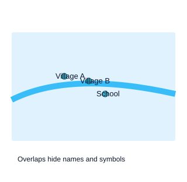
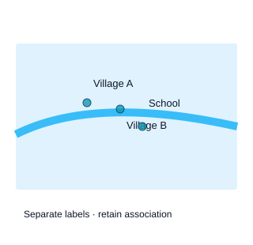

# មេរៀនទី១៣៖ អក្សរ និងការដាក់ស្លាកលើផែនទី

!!! info "ព័ត៌មានមេរៀន"
    **រយៈពេលបង្រៀនដែលស្នើ៖ ៣ ម៉ោង** · មេរៀនទី ១៣ ក្នុងចំណោម ១៥

អក្សរជាធាតុដែលអ្នកអានចំណាយពេលច្រើនបំផុត ប៉ុន្តែអ្នកធ្វើផែនទីតែងចំណាយពេលតិចបំផុត។ ស្លាកប្រាប់ថាវត្ថុនីមួយៗឈ្មោះអ្វី ហើយវាក៏ជាធាតុដែលធ្វើឲ្យផែនទីមើលទៅរញ៉េរញ៉ៃបំផុតដែរ។

មេរៀននេះពន្យល់ការជ្រើសពុម្ពអក្សរ ក្បួនដាក់ស្លាក ការដោះស្រាយការជាន់គ្នា និងចំណុចពិសេសសម្រាប់អក្សរខ្មែរលើផែនទី។

---

## ១៣.១. គោលបំណងសិក្សា

បន្ទាប់ពីបញ្ចប់មេរៀន និស្សិតអាច៖

1. ជ្រើសពុម្ពអក្សរ និងទំហំសមរម្យសម្រាប់ផែនទីបោះពុម្ព និងអេក្រង់។
2. អនុវត្តក្បួនដាក់ស្លាកសម្រាប់ចំណុច បន្ទាត់ និងផ្ទៃ។
3. ប្រើស្រទាប់ស (halo) លំដាប់អាទិភាព និងការដោះស្រាយការជាន់គ្នា។
4. បង្កើតឋានានុក្រមអក្សរ (typographic hierarchy) លើផែនទី។
5. ដោះស្រាយបញ្ហាពិសេសនៃអក្សរខ្មែរលើផែនទី។

### ចំណេះដឹងមុនត្រូវមាន

- ខ្លឹមសារ[មេរៀនទី៦](lesson-06.md)៖ ឋានានុក្រមមើលឃើញ។

---

## ១៣.២. ស្ថានភាពបើកមេរៀន៖ ផែនទីដែលអានឈ្មោះមិនបាន

និស្សិតម្នាក់ធ្វើផែនទីឃុំមួយ ហើយបើកស្លាកឈ្មោះភូមិទាំងអស់។ លទ្ធផល៖ ស្លាក ១២០ ជាន់គ្នា អក្សរខ្លះធ្លាក់លើទន្លេពណ៌ខៀវដិត ហើយស្រៈខ្មែរខ្លះកាត់ដោយព្រំពហុកោណ។

គ្រូសួរថា៖ «តើអ្នកអានត្រូវការឈ្មោះភូមិទាំង ១២០ ឬតែឈ្មោះដែលពាក់ព័ន្ធនឹងសំណួរ?»

សំណួរដែលមេរៀននេះឆ្លើយ៖

- តើត្រូវជ្រើសស្លាកមួយណាបង្ហាញ?
- តើដាក់ស្លាកនៅកន្លែងណា ដើម្បីកុំឲ្យជាន់គ្នា?
- តើអក្សរខ្មែរលើផែនទីត្រូវការការប្រុងប្រយ័ត្នអ្វីខ្លះ?

---

## ១៣.៣. ទ្រឹស្ដីស្នូល

### ១៣.៣.១. ពុម្ពអក្សរ និងទំហំ

| លក្ខណៈ | ការណែនាំសម្រាប់ផែនទី |
|---|---|
| ប្រភេទ | ពុម្ពអក្សរច្បាស់ អានងាយ · ជៀសវាងពុម្ពអក្សរតុបតែង |
| ចំនួនពុម្ពអក្សរ | ១ ឬ ២ គ្រួសារពុម្ពអក្សរ ក្នុងផែនទីតែមួយ |
| ទំហំអប្បបរមា (បោះពុម្ព) | ៦ ទៅ ៧ pt សម្រាប់អក្សរឡាតាំង · ៨ pt ឡើងទៅសម្រាប់អក្សរខ្មែរ |
| ទំហំលើអេក្រង់ | ១១ px ឡើងទៅ · ធំជាងសម្រាប់ទូរស័ព្ទ |
| ភាពខុសគ្នា | ប្រើទំហំ ទម្ងន់ (bold) និងអក្សរទ្រេត ដើម្បីបែងចែកប្រភេទ |

**ឋានានុក្រមអក្សរ**៖ ធាតុសំខាន់ជាង = អក្សរធំជាង ឬដិតជាង។ ឧទាហរណ៍៖ រាជធានី ១១ pt ដិត · ទីរួមខេត្ត ៩ pt · ឃុំ ៨ pt · ភូមិ ៧ pt។

**ទម្លាប់ផែនទីវិទ្យា**៖ ទឹក (ទន្លេ បឹង សមុទ្រ) ដាក់ស្លាកជា **អក្សរទ្រេត** ពណ៌ខៀវ។ តំបន់រដ្ឋបាលធំៗ អាចប្រើអក្សរដាក់ចន្លោះធំ (letter-spacing)។

### ១៣.៣.២. ក្បួនដាក់ស្លាក

<figure markdown>
--8<-- "assets/svg/c13-labels.svg"
<figcaption>រូបទី១៣.១៖ ក្បួនដាក់ស្លាក៖ លំដាប់អាទិភាពនៃទីតាំងជុំវិញចំណុច · ស្រទាប់ស ធ្វើឲ្យអក្សរអានបានលើផ្ទៃពណ៌ · ស្លាកបន្ទាត់ដាក់តាមខ្សែ។</figcaption>
</figure>

| ធរណីមាត្រ | ក្បួន |
|---|---|
| **ចំណុច** | អាទិភាព៖ ស្ដាំលើ → ឆ្វេងលើ → ស្ដាំក្រោម → ឆ្វេងក្រោម · ចម្ងាយ ១ ទៅ ២ pt ពីសញ្ញា |
| **បន្ទាត់** | ដាក់តាមខ្សែ (curved) ខាងលើខ្សែ · ធ្វើម្ដងទៀតបើខ្សែវែង · មិនដាក់បញ្ច្រាស |
| **ផ្ទៃ** | កណ្ដាលផ្ទៃ · តាមរូបរាងផ្ទៃវែង · ប្រើស្លាកខាងក្រៅ និងខ្សែយោង បើផ្ទៃតូចពេក |

ក្បួនទូទៅ៖ ស្លាកមិនគួរជាន់លើ **វត្ថុដែលវាមិនសំដៅ** · មិនកាត់ដោយព្រំដែន · មិនដាក់ក្បែរគែមផែនទីពេក។

!!! example "ពិសោធន៍៖ ស្លាក និងការជាន់គ្នា"
    បង្កើនទំហំអក្សរ ហើយសង្កេតថាស្លាកប៉ុន្មានត្រូវលាក់។ បិទ «ជៀសវាងការជាន់គ្នា» ដើម្បីមើលអ្វីដែលកើតឡើងបើគ្មានក្បួន។ បន្ទាប់មក ត្រងតែខេត្តធំ។

### ១៣.៣.៣. ការដោះស្រាយការជាន់គ្នា

ពេលស្លាកច្រើនពេក មានវិធីបួន៖

1. **ត្រង (Selection)**៖ បង្ហាញតែស្លាកសំខាន់ (ឧ. ភូមិដែលមានប្រជាជនលើស ១ ០០០ ឬឈ្មោះដែលពាក់ព័ន្ធនឹងសំណួរ)។
2. **ត្រងតាមមាត្រដ្ឋាន (Scale-dependent)**៖ បង្ហាញស្លាកភូមិតែនៅមាត្រដ្ឋានធំ។
3. **កាត់បន្ថយទំហំ ឬចន្លោះ**៖ ប៉ុន្តែកុំតូចជាងទំហំអប្បបរមា។
4. **អនុញ្ញាតឲ្យ QGIS លាក់ស្លាកមួយចំនួន**៖ កំណត់ **Priority** សម្រាប់ស្រទាប់នីមួយៗ (ស្រទាប់សំខាន់ទទួលអាទិភាពខ្ពស់)។

ក្នុង QGIS៖ **Labels → Placement** (ទីតាំង) · **Rendering** (Scale dependent visibility · Show all labels · Priority) · **Buffer** (ស្រទាប់ស) · **Callouts** (ខ្សែយោងសម្រាប់ស្លាកដែលរំកិល)។

### ១៣.៣.៤. អក្សរខ្មែរលើផែនទី

អក្សរខ្មែរមានលក្ខណៈពិសេសដែលប៉ះពាល់ការដាក់ស្លាក៖

| បញ្ហា | ដំណោះស្រាយ |
|---|---|
| ស្រៈ និងជើងខាងលើ និងខាងក្រោម ត្រូវការកម្ពស់ជួរច្រើន | បង្កើនទំហំអក្សរ និងចន្លោះជួរ (line spacing ១,២ ដល់ ១,៤) |
| អក្សរតូចពេក ធ្វើឲ្យជើង និងស្រៈជាប់គ្នា | ទំហំអប្បបរមា ៨ pt សម្រាប់បោះពុម្ព |
| ពុម្ពអក្សរខ្លះបង្ហាញខុស ឬបាត់ស្រៈ | ប្រើពុម្ពអក្សរដែលសាកល្បងរួច (Battambang · Khmer OS Siemreap · Noto Sans Khmer) |
| ការកាត់ជួរ (line break) ខុសកន្លែង | កាត់ដោយដៃ ដោយបញ្ចូលអក្សរបន្ទាត់ថ្មីក្នុងកន្សោមស្លាក |
| លាយអក្សរខ្មែរ និងឡាតាំង | កំណត់ទំហំខុសគ្នាបន្តិច ព្រោះអក្សរខ្មែរមើលទៅតូចជាងនៅទំហំដូចគ្នា |

!!! tip "សាកល្បងមុនបញ្ចប់"
    នាំចេញ PDF រួចពង្រីក ៤០០% ដើម្បីពិនិត្យស្រៈ និងជើង។ បោះពុម្ពគំរូមួយសន្លឹក ដើម្បីពិនិត្យទំហំពិត។ បញ្ហាអក្សរខ្មែរភាគច្រើនមើលមិនឃើញលើអេក្រង់ទេ។

### ១៣.៣.៥. អ្វីដែលត្រូវដាក់ស្លាក

ស្លាកត្រូវឆ្លើយសំណួររបស់អ្នកអាន មិនមែនបង្ហាញអ្វីៗទាំងអស់ដែលមានក្នុងទិន្នន័យទេ៖

- **ផែនទីយោង**៖ ស្លាកច្រើន ព្រោះគោលបំណងគឺរកទីតាំង។
- **ផែនទីប្រធានបទ**៖ ស្លាកតិច ព្រោះគោលបំណងគឺមើលលំនាំ។ ដាក់ស្លាកតែកន្លែងយោង (រាជធានី ទីរួមខេត្ត) និងកន្លែងដែលអត្ថបទនិយាយអំពី។
- **ផែនទីសម្រាប់បទបង្ហាញ**៖ ស្លាកតិចបំផុត អក្សរធំបំផុត។

ក្បួន៖ បើអ្នកមិនអាចពន្យល់ថាហេតុអ្វីស្លាកមួយនៅទីនោះ ចូរលុបវា។

---

## ១៣.៤. ឧទាហរណ៍ដែលបានដោះស្រាយ៖ ដាក់ស្លាកផែនទីខេត្តឲ្យអានបាន

ផែនទីដង់ស៊ីតេប្រជាជនតាមខេត្ត ដែលត្រូវបោះពុម្ព A4។

### ជំហានទី១៖ សម្រេចថាដាក់ស្លាកអ្វី

សំណួរ៖ «ដង់ស៊ីតេខ្ពស់នៅឯណា?» → ត្រូវការឈ្មោះខេត្តទាំង ២៥ ជាកន្លែងយោង ប៉ុន្តែមិនត្រូវការឈ្មោះស្រុក ឬទន្លេទាំងអស់ទេ។

### ជំហានទី២៖ កំណត់ឋានានុក្រម

ភ្នំពេញ ១០ pt ដិត · ខេត្តផ្សេង ៨,៥ pt · ទន្លេសាប ៨ pt អក្សរទ្រេតពណ៌ខៀវ។

### ជំហានទី៣៖ ដាក់ស្រទាប់ស និងអាទិភាព

Buffer ពណ៌ស ០,៨ មម សម្រាប់ស្លាកទាំងអស់ · Priority ខ្ពស់សម្រាប់ស្រទាប់ខេត្ត · Priority ទាបសម្រាប់ទន្លេ។

### ជំហានទី៤៖ ដោះស្រាយការជាន់គ្នា

ខេត្តតូចជុំវិញភ្នំពេញ (កណ្ដាល កែប) មិនមានកន្លែងគ្រប់គ្រាន់។ ប្រើ **Callouts** (ខ្សែយោង) ដើម្បីរំកិលស្លាកចេញក្រៅ ហើយភ្ជាប់ដោយខ្សែស្ដើង។

### ជំហានទី៥៖ ពិនិត្យអក្សរខ្មែរ

នាំចេញ PDF ៣០០ dpi ពង្រីក ៤០០% ហើយពិនិត្យស្រៈ និងជើងនៃឈ្មោះដែលមានជើង (ឧ. «ព្រះវិហារ» «ត្បូងឃ្មុំ»)។

### សេចក្ដីសន្និដ្ឋានដែលសមស្រប

> «ការត្រងស្លាក ការកំណត់ឋានានុក្រម និងការប្រើស្រទាប់ស និងខ្សែយោង ធ្វើឲ្យផែនទីខេត្តទាំង ២៥ អានបានលើ A4 ដោយមិនមានស្លាកជាន់គ្នា។»

!!! warning "អ្វីដែលយើងមិនអាចសន្និដ្ឋាន"
    ការដាក់ស្លាកល្អ មិនអាចជួសជុលផែនទីដែលមានទិន្នន័យច្រើនពេកបានទេ។ បើផែនទីត្រូវការស្លាក ១២០ ដើម្បីឆ្លើយសំណួរ នោះមាត្រដ្ឋាន ឬតំបន់សិក្សាត្រូវកែជាមុនសិន។

---

## សិក្ខាសាលារូបភាព៖ ដាក់ស្លាកដោយគិតពីអ្វីដែលវាគ្រប

!!! note "រៀនដោយសាកល្បង · 35–45 នាទី"
    ផ្នែកនេះប្រើជំនួសពេលពិភាក្សា និងសកម្មភាពក្នុងម៉ោង 180 នាទី មិនមែនបន្ថែមលើម៉ោងទាំងអស់ទេ។ លេខដែលសរសេរថា «សន្មត» និងរូបប្រៀបធៀបថ្មីជាគំរូបង្រៀន មិនមែនស្ថិតិផ្លូវការ ឬផែនទីសម្រាប់នាវាចរណ៍ទេ។

### បញ្ហាដែលត្រូវដោះស្រាយ

ឈ្មោះភូមិខ្មែរមានប្រវែងខុសគ្នា។ ដាក់ស្លាកនៅកណ្តាលចំណុចគ្រប់ទីកន្លែងធ្វើឲ្យស្លាកជាន់ផ្លូវ និងសញ្ញា។ ការដោះស្រាយមិនមែនគ្រាន់តែបង្រួមអក្សរទេ។

### ពន្យល់ឲ្យឃើញមូលហេតុ

Label placement ជាការសម្រេចចិត្តរវាងភាពអាចអាន និងភាពជាប់ទាក់ទងនឹងវត្ថុ។ សម្រាប់ចំណុច សាកល្បងទីតាំងក្បែរៗដែលមិនជាន់សញ្ញា។ សម្រាប់ទន្លេ ប្រើស្លាកតាមខ្សែដោយរក្សាទិសអាន។ សម្រាប់ផ្ទៃធំ កុំដាក់អក្សរលាតឆ្ងាយពេករហូតអានមិនជាប់។

អក្សរខ្មែរត្រូវការកម្ពស់បន្ទាត់ និងពុម្ពអក្សរដែលបង្ហាញជើងអក្សរ និងស្រៈត្រឹមត្រូវ។ Halo ស្រាលអាចជួយនៅលើផ្ទៃស្មុគស្មាញ ប៉ុន្តែ halo ក្រាស់អាចលុបបរិបទ។ ពិនិត្យទំហំពិតក្នុង PDF និងទូរស័ព្ទ មិនមើលតែពេល zoom ធំ។

### មើល → ប្រៀបធៀប → ពន្យល់

<figure><figcaption><b>បញ្ហា / Before</b> — ស្លាកជាន់គ្នា និងគ្របសញ្ញាទីតាំង។</figcaption></figure>
<figure><figcaption><b>កែលម្អ / After</b> — ផ្លាស់ទីស្លាក រក្សាការភ្ជាប់ទៅទីតាំង និងបង្កើតអាទិភាព។</figcaption></figure>

រូបថ្មីទាំងនេះជាគំនូរបង្ហាញគោលគំនិត។ ស្លាកបច្ចេកទេសខ្លីជាភាសាអង់គ្លេសមានការពន្យល់ជាភាសាខ្មែរខាងក្រោមរូបនីមួយៗ។ មុនអានចម្លើយ សរសេរភាពខុសគ្នាដែលប៉ះពាល់ដល់ការបកស្រាយពីរចំណុច។

### គណនា និងសម្រេចចិត្តមួយជំហានម្តង

នៅ 1:50000 ការផ្លាស់ស្លាក 2 មមលើក្រដាសស្មើ 100 មលើដី ប៉ុន្តែវាគ្រាន់តែផ្លាស់អក្សរ មិនមែនផ្លាស់ទីចំណុច។ បើស្លាកឆ្ងាយរហូតមិនដឹងភ្ជាប់ទៅវត្ថុណា ប្រើ leader line ឬលាក់ស្លាកអាទិភាពទាប។ ការផ្លាស់សញ្ញាភូមិផ្ទាល់ជាការសម្រេចចិត្តខុសពីផ្លាស់ស្លាក។

### ពិសោធន៍ដោយមានសំណួរណែនាំ

1. ក្នុង label studio អូសស្លាកឲ្យជាន់គ្នា ហើយអាន feedback។
2. ប្រើក្តារចុច Tab ដើម្បីជ្រើសស្លាក ហើយប្រើព្រួញផ្លាស់ទី។
3. ដោះស្រាយការជាន់គ្នាដោយរក្សាស្លាកជិតចំណុច ហើយពិនិត្យអក្សរខ្មែរ។

| សាកល្បង | ការព្យាករណ៍មុនចុច | អ្វីដែលឃើញ | មូលហេតុ |
|---|---|---|---|
| លក្ខខណ្ឌដើម | សរសេរការរំពឹង | កត់តម្លៃ/លំនាំ | ភ្ជាប់ទៅគោលគំនិត |
| ប្តូរអថេរមួយ | ព្យាករណ៍ម្តងទៀត | ប្រៀបធៀបនឹងដើម | ពន្យល់ដោយភស្តុតាង |

### បញ្ហាប្រឈមតូច និងការផ្ទេរទៅ QGIS

**បញ្ហាប្រឈម៖** ដាក់ស្លាកទីតាំង 3 ក្នុង sandbox ដោយគ្មានការជាន់។ បន្ទាប់មកពន្យល់ថាតើ feedback ស្វ័យប្រវត្តិអាចជំនួសការវាយតម្លៃអ្នកអានបានឬទេ។

**QGIS៖** Layer Properties → Labels៖ សាកល្បង Offset from point, Buffer និង Priority។ ប្រើ Move Label ជាមួយ auxiliary storage បើត្រូវផ្លាស់ដោយដៃ។ Export PDF ហើយពិនិត្យពាក្យខ្មែរទាំងមូល។

**លទ្ធផលត្រូវប្រគល់៖** រូបភាពមុន/ក្រោយមួយគូ តារាងតម្លៃ ឬការកំណត់ដែលបានប្តូរ និងការពន្យល់ 3–5 ប្រយោគ។ ពិនិត្យថាអ្នកអានម្នាក់ទៀតអាចធ្វើការគណនាឡើងវិញបាន។ បន្តទៅ [លំហាត់ QGIS 13](../workbook/lab-13.md) សម្រាប់ការអនុវត្តពេញលេញ។

### សាកល្បងចំណេះដឹងដោយខ្លួនឯង

<fieldset data-answer="1"><legend>1. ស្លាកជាន់គ្នា គួរសាកល្បងអ្វីមុន?</legend><label><input type="radio" name="rich-13-0" value="0"> បង្រួមអក្សរទាំងអស់ឲ្យតូចបំផុត</label><label><input type="radio" name="rich-13-0" value="1"> ផ្លាស់ទី និងកំណត់អាទិភាព</label><label><input type="radio" name="rich-13-0" value="2"> លុបទីតាំងចេញ</label>

មើលហេតុផល / Explanation

ផ្លាស់ទី និងកំណត់អាទិភាព — រក្សាភាពអាចអាន និងអត្ថន័យទីតាំង។

</fieldset>
<fieldset data-answer="2"><legend>2. ផ្លាស់ស្លាកមានន័យថាទីតាំងវត្ថុប្តូរឬ?</legend><label><input type="radio" name="rich-13-1" value="0"> បាទ</label><label><input type="radio" name="rich-13-1" value="1"> តែខ្មែរ</label><label><input type="radio" name="rich-13-1" value="2"> ទេ</label>

មើលហេតុផល / Explanation

ទេ — អក្សរ និងធរណីមាត្រជាផ្នែកខុសគ្នា។

</fieldset>
<fieldset data-answer="0"><legend>3. Halo គួរ?</legend><label><input type="radio" name="rich-13-2" value="0"> ស្រាល និងសមនឹងផ្ទៃក្រោយ</label><label><input type="radio" name="rich-13-2" value="1"> ក្រាស់បំផុត</label><label><input type="radio" name="rich-13-2" value="2"> មានគ្រប់ស្លាកដោយមិនពិនិត្យ</label>

មើលហេតុផល / Explanation

ស្រាល និងសមនឹងផ្ទៃក្រោយ — Halo ក្រាស់អាចគ្របព័ត៌មានផ្សេង។

</fieldset>

**សំណួរចាកចេញ៖** ជម្រើសណាមួយរបស់អ្នកអាចធ្វើឲ្យអ្នកអានយល់ខុស? ពន្យល់ការកែ និងដែនកំណត់ដែលនៅសល់។

---

## ១៣.៥. សកម្មភាពអនុវត្ត

!!! tip "លំហាត់នេះស្ថិតក្នុងសៀវភៅអនុវត្ត"
    ការអនុវត្តលើ QGIS សម្រាប់មេរៀននេះស្ថិតក្នុង [**លំហាត់ទី១៣**](../workbook/lab-13.md)។

    និស្សិតធ្វើលំហាត់នេះ **ដោយខ្លួនឯង** នៅក្រៅម៉ោងរៀន។

---

## ១៣.៦. ការយល់ច្រឡំដែលត្រូវប្រុងប្រយ័ត្ន

**១. «ស្លាកទាំងអស់ត្រូវបង្ហាញ»**
ស្លាកត្រូវឆ្លើយសំណួររបស់អ្នកអាន។ ស្លាកច្រើនពេកលាក់លំនាំ។

**២. «អក្សរតូចជាងធ្វើឲ្យដាក់បានច្រើនជាង»**
តូចជាងទំហំអប្បបរមា មានន័យថាគ្មាននរណាអានបាន ជាពិសេសអក្សរខ្មែរ។

**៣. «ស្រទាប់ស (halo) ធ្វើឲ្យផែនទីកខ្វក់»**
ស្រទាប់សស្ដើង (០,៨ មម) ធ្វើឲ្យអក្សរអានបាន។ ស្រទាប់ក្រាស់ពេកទើបជាបញ្ហា។

**៤. «ពុម្ពអក្សរណាក៏បានសម្រាប់អក្សរខ្មែរ»**
ពុម្ពអក្សរខ្លះបង្ហាញស្រៈ និងជើងខុស។ ត្រូវសាកល្បង និងពិនិត្យ PDF ជានិច្ច។

**៥. «ស្លាកគួរដាក់នៅកណ្ដាលវត្ថុជានិច្ច»**
សម្រាប់ចំណុច ស្ដាំលើជាអាទិភាព។ សម្រាប់បន្ទាត់ ដាក់តាមខ្សែ។

---

## ១៣.៧. សេចក្ដីសង្ខេបមេរៀន

អក្សរលើផែនទីត្រូវការការជ្រើសពុម្ពអក្សរ ទំហំ និងឋានានុក្រមច្បាស់លាស់។ ក្បួនដាក់ស្លាកខុសគ្នាតាមធរណីមាត្រ ហើយការជាន់គ្នាដោះស្រាយដោយការត្រង ការត្រងតាមមាត្រដ្ឋាន អាទិភាព និងខ្សែយោង។

អក្សរខ្មែរត្រូវការទំហំធំជាង ចន្លោះជួរច្រើនជាង និងពុម្ពអក្សរដែលសាកល្បងរួច ព្រមទាំងការពិនិត្យ PDF មុនបោះពុម្ព។

!!! abstract "គំនិតស្នូលនៃមេរៀន"
    ស្លាកនីមួយៗត្រូវមានហេតុផល។ ផែនទីដែលមានស្លាកតិច ប៉ុន្តែត្រឹមត្រូវ អានបានជាងផែនទីដែលមានស្លាកគ្រប់វត្ថុ។

---

## ១៣.៨. ពាក្យគន្លឹះខ្មែរ–អង់គ្លេស

| ពាក្យខ្មែរ | ពាក្យអង់គ្លេស | អត្ថន័យខ្លី |
|---|---|---|
| ស្លាក | Label | អក្សរដែលដាក់លើវត្ថុ |
| ពុម្ពអក្សរ | Font / typeface | គ្រួសារអក្សរ |
| ស្រទាប់ស | Halo / buffer | ស្រទាប់ជុំវិញអក្សរ |
| ឋានានុក្រមអក្សរ | Typographic hierarchy | ទំហំ និងទម្ងន់តាមសារៈសំខាន់ |
| ស្លាកតាមខ្សែ | Curved label | ស្លាកដាក់តាមបន្ទាត់ |
| ខ្សែយោង | Callout | ខ្សែភ្ជាប់ស្លាកទៅវត្ថុ |
| អាទិភាពស្លាក | Label priority | លំដាប់ពេលមានការជាន់គ្នា |
| ត្រងតាមមាត្រដ្ឋាន | Scale-dependent visibility | បង្ហាញតាមមាត្រដ្ឋាន |

---

## ១៣.៩. សំណួររំលឹក និងវាយតម្លៃ

### ក. សំណួរយល់ដឹង

1. រាយលំដាប់អាទិភាពនៃទីតាំងស្លាកសម្រាប់ចំណុច។
2. ហេតុអ្វីអក្សរខ្មែរត្រូវការទំហំធំជាងអក្សរឡាតាំង?
3. រាយវិធីបួនដើម្បីដោះស្រាយការជាន់គ្នានៃស្លាក។
4. ស្រទាប់ស (halo) មានតួនាទីអ្វី?
5. ទម្លាប់ផែនទីវិទ្យាសម្រាប់ស្លាកទឹកគឺអ្វី?

### ខ. សំណួរអនុវត្តគោលគំនិត

6. ផែនទីឃុំមួយមានភូមិ ១២០។ ស្នើក្បួនត្រងស្លាក ៣ យ៉ាង។
7. ស្លាក «ព្រះវិហារ» បង្ហាញស្រៈខុសក្នុង PDF។ រាយជំហានពិនិត្យ និងកែ។
8. សរសេរឋានានុក្រមអក្សរសម្រាប់ផែនទីទីក្រុងមួយ (ទីក្រុង សង្កាត់ ផ្លូវ ទន្លេ)។
9. ផែនទីបទបង្ហាញត្រូវបញ្ចាំងលើអេក្រង់ធំ។ តើអ្នកនឹងកែស្លាកយ៉ាងណា ធៀបនឹងកំណែបោះពុម្ព?
10. ខេត្តតូចៗជុំវិញភ្នំពេញគ្មានកន្លែងសម្រាប់ស្លាក។ ស្នើដំណោះស្រាយពីរ។

### គ. កិច្ចការខ្លី

យកផែនទីមួយដែលអ្នកបានធ្វើក្នុងលំហាត់មុន ហើយកែស្លាកឡើងវិញ៖ កំណត់ឋានានុក្រម ៣ កម្រិត · បន្ថែមស្រទាប់ស · ត្រងស្លាកតាមក្បួនមួយដែលអ្នកសរសេរ · នាំចេញ PDF ហើយពិនិត្យអក្សរខ្មែរនៅ ៤០០%។ សរសេរអ្វីដែលអ្នកបានកែ និងហេតុផល។

---

## កំណត់សម្គាល់សម្រាប់គ្រូបង្រៀន

### ក. ការបែងចែកពេលវេលា ១៨០ នាទី

| សកម្មភាព | ពេលវេលា |
|---|---:|
| ស្ថានភាពបើកមេរៀន៖ ស្លាក ១២០ | ១៥ នាទី |
| ពុម្ពអក្សរ និងទំហំ | ២៥ នាទី |
| ក្បួនដាក់ស្លាក និងពិសោធន៍ | ៤០ នាទី |
| ការដោះស្រាយការជាន់គ្នា | ៣០ នាទី |
| អក្សរខ្មែរលើផែនទី | ៣៥ នាទី |
| អ្វីដែលត្រូវដាក់ស្លាក និងឧទាហរណ៍ | ៣០ នាទី |
| សង្ខេប និងណែនាំលំហាត់ | ៥ នាទី |
| **សរុប** | **១៨០ នាទី / ៣ ម៉ោង** |

### ខ. ការភ្ជាប់ទៅមេរៀនបន្ទាប់

យើងមានផែនទី និងស្លាកហើយ។ ដល់ពេលរៀបចំធាតុទាំងអស់លើទំព័រ។ ចូរបញ្ចប់ដោយបង្ហាញប្លង់ពីរ (ល្អ និងច្របូកច្របល់) ហើយសួរ៖

> «ហេតុអ្វីភ្នែកយើងដឹងភ្លាមថាប្លង់មួយណារៀបរយ?»

សំណួរនេះនាំទៅ [**មេរៀនទី១៤៖ ប្លង់ផែនទី និងឋានានុក្រមមើលឃើញ**](lesson-14.md)។

⬅️ [មេរៀនទី១២](lesson-12.md) · ➡️ [មេរៀនទី១៤](lesson-14.md)
